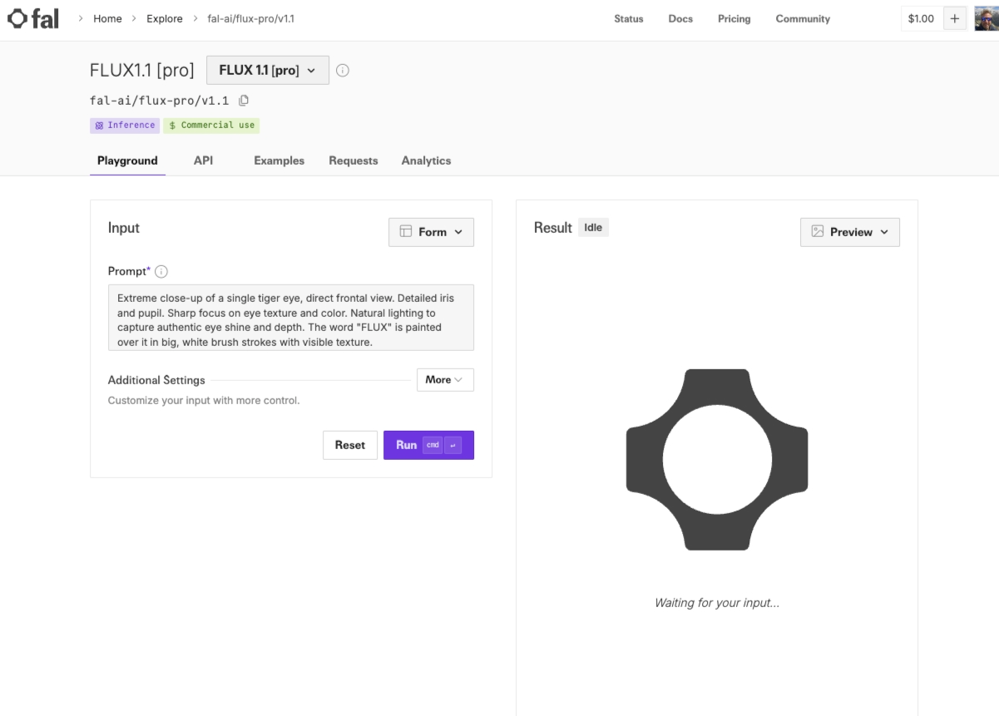
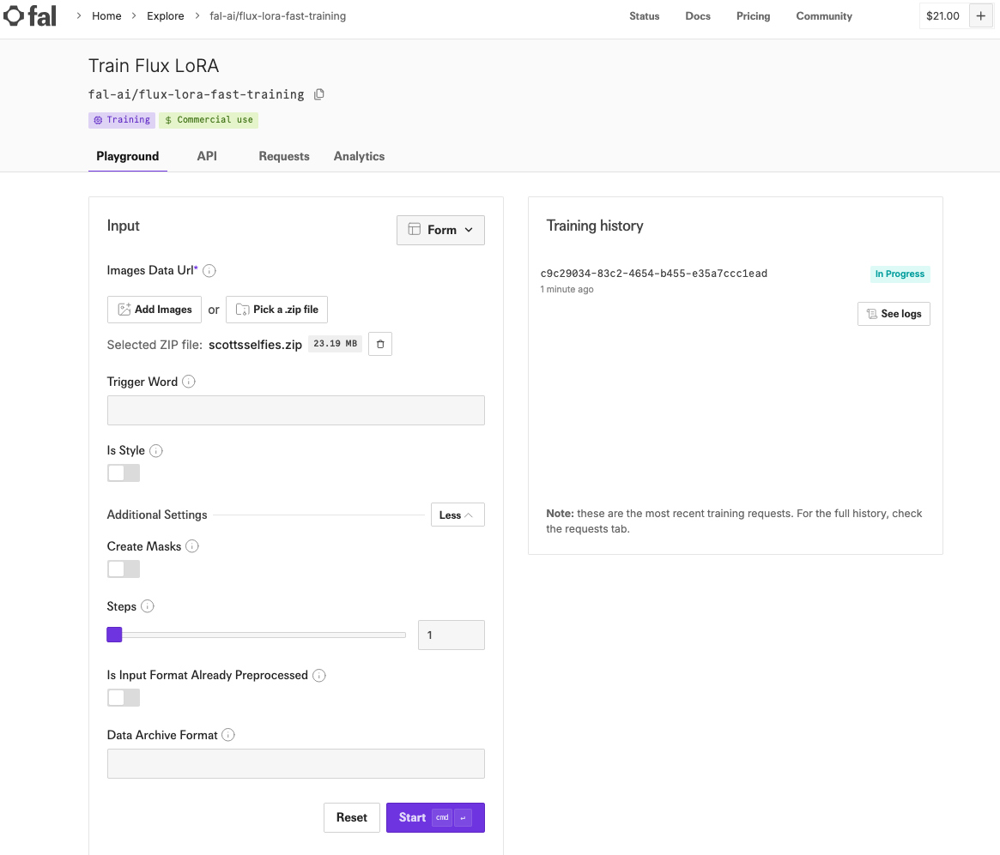
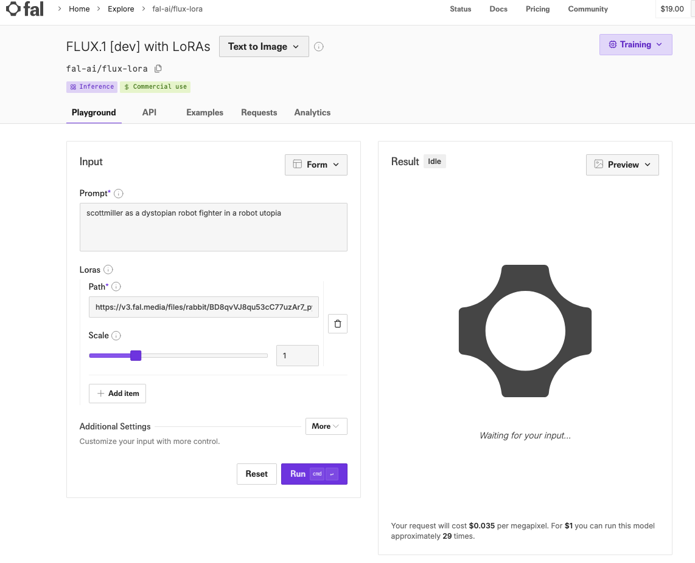

# Generate Realistic Headshots using Flux

## Get Selfies

1. Go to [BlackForestLabs and get Flux](https://blackforestlabs.ai/ultra-home/#get-flux)
Use the latest pro model on the Fa.ai playground

2. Sign up on Fal.ai using your GitHub account. You will need to buy credit.  I purchased $20 in credit

3. You should see the Flux Pro model

4. Take photos of 15-20 selfie in various angles 

5. Put them in a folder
   
6. Rename the photos so they have your name in them.  For example, photo_of_scottmiller_XXXX.jpg

7.  Zip the photos

## Train a Flux Lora

1.  Go to Train Flux LoRA using flux-lora-fast-training 
    

2. Upload the zip of selfies
3. Set the Trigger word as your name scottmiller
4. Start the training 
5. Once the training is done click 'run inference'
6. You will get a Lora URL.  Mine is 
   'https://v3.fal.media/files/rabbit/BD8qvVJ8qu53cC77uzAr7_pytorch_lora_weights.safetensors'

## Run the trained model

1. Specify the text to run and include the keyword of your name
   
2. Examples
scottmiller as a Battle Angel in a utopia
full body shot will zoom out
close up

scottmiller as a battle warrior in a utopia full body shot

Guidance Scale

## Reference
https://www.youtube.com/watch?v=lcNb-0XspwU&t=360s